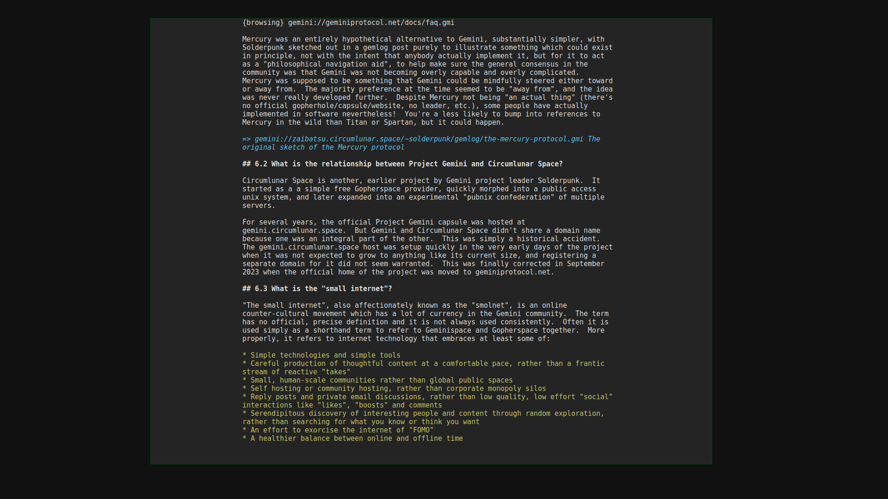

# Astrology Gemini Client

Astrology is a minimalist, ncurses-based gemini client with simplicity in mind. The name pays tribute to the SCIENCE of Astrology which the current world order is actively trying to silence and humiliate. I hope that this project spreads some sort of awareness. It doesn't take a genius to realize that the gravitational pull of celestial bodies located light years away from us can influence our behavior! Wake up sheeple!!1!

TLS certificate verification is not yet implemented! You can configure the application by modifying `config.h` (compiling from source is incredibly fast).

